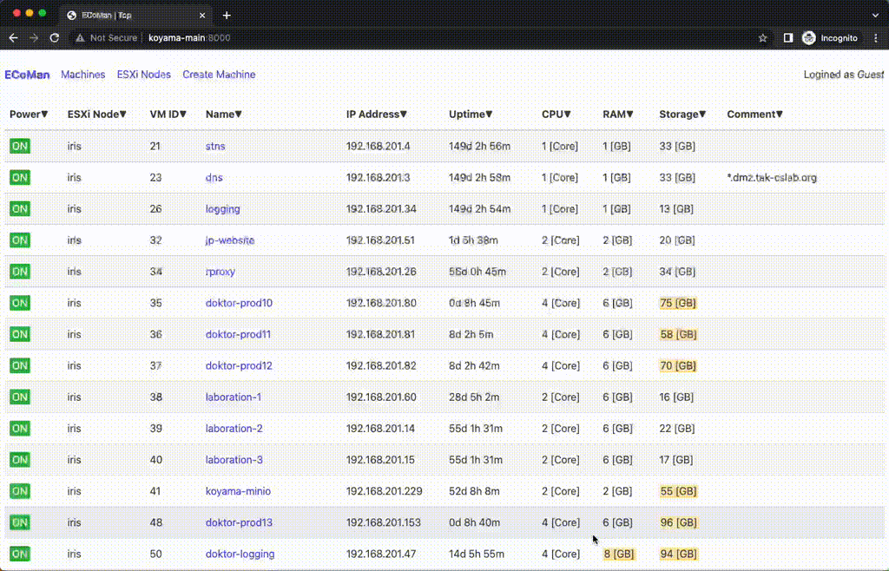
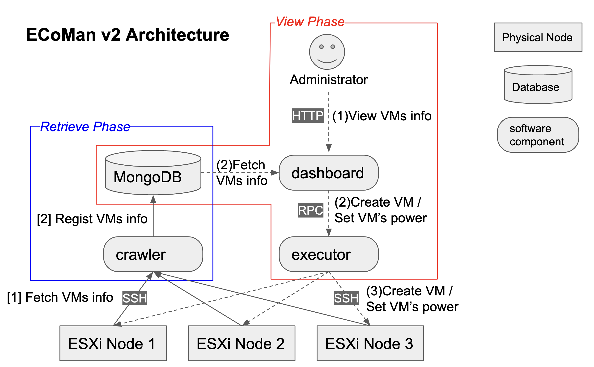

# ECoMan

ECoMan is a tool for supporting virtual machine management on VMware ESXi.
It provides administrators to view virtual machine lists with web user interface.



## Feature

- View virtual machine lists over multiple ESXi Nodes
- Create a virtual machine via Web UI
- Set power status via Web UI

## Getting Started

TBD

```
uvicorn main:app --reload
```

## Architecture

ECoMan has following system archtiecture.

- `crawler` fetches VMs info via SSH and regist VMs info to MongoDB. This component works by polling.
- `dashboard` provides Web UI to Administrators. When Administrator accesses `dashboard`, it fetches VMs info from MongoDB and returns to Administrator.
- `executor` receives actions, "Create VM" or "Update VM's power", from `dashboard` and does the actions via SSH.

